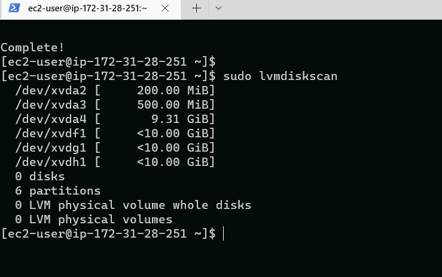
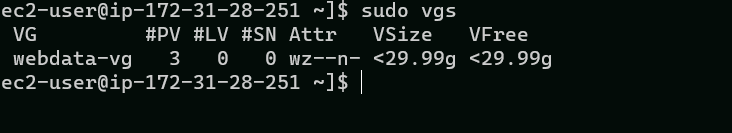

## PROJECT 7: 

### **STEP 1 — PREPARING THE NFS SERVER**

First, I launched five EC2 instances: four Red Hat (one NFS server and three web servers) and one Ubuntu server  (to server as the database server).

Next, I created 3 volumes in the same AZ (Availability Zone) as my NFS Server, each of 10 GiB and respectively name nfs1, nfs2 and nfs3.

Next, I spinned up the Red Hat EC2 instance and ran the command below:

`lsblk`

To see all (available) mount points and free space on my server, I ran this command:

`df -h`

Next, I used the *gdisk* utility to create a single partition on each of the 3 disks, beginning with the first volume, using the command below:

`sudo gdisk /dev/xvdf`

I repeated the last step for the *xvdg disk*, as below:

`sudo gdisk /dev/xvdg`

Similarly, the previous step was repeated the *xvdh disk*, as below:

`sudo gdisk /dev/xvdh`

Next, I used the `lsblk` utility to view the newly configured partition on each of the 3 disks. This is displayed below:

Next, I installed *lvm2* package using sudo yum install lvm2 by running the command below

`sudo yum install lvm2 -y`

To check for available partitions, I ran the command below:

`sudo lvmdiskscan`

The output is shown below:

Next, I used the *pvcreate* utility to mark each of 3 disks as physical volumes (PVs) to be used by LVM

`sudo pvcreate /dev/xvdf1 /dev/xvdg1 /dev/xvdh1`

To verify that the Physical volume has been created successfully, I ran this command:

`sudo pvs`

Next, I used the  *vgcreate utility* to add all 3 PVs to a volume group (VG). The VG was named *webdata-vg*

`sudo vgcreate webdata-vg /dev/xvdf1 /dev/xvdg1 /dev/xvdh1`

To verify that this was done successfully, I ran the command:

`sudo vgs`

Next, I used the *lvcreate utility* to create 3 logical volumes of equal sizes (9G each) named **lv-opt**, **lv-apps** and **lv-logs**, with the commands below:

`sudo lvcreate -n lv-opt -L 9G webdata-vg`

`sudo lvcreate -n lv-apps -L 9G webdata-vg`

`sudo lvcreate -n lv-logs -L 9G webdata-vg`

To verify that the Logical Volumes has been created successfully, i ran the command below:

`sudo lvs`

`sudo vgdisplay -v #view complete setup - VG, PV, and LV`

`sudo lsblk`

Next, I used *mkfs -t xfs* to format the logical volumes with xfs filesystem, using the commands below:

`sudo mkfs -t xfs /dev/webdata-vg/lv-opt`

`sudo mkfs -t xfs /dev/webdata-vg/lv-apps`

`sudo mkfs -t xfs /dev/webdata-vg/lv-logs`

Next, I created mount points on /mnt directory for the logical volumes as follow:

    Mount lv-apps on /mnt/apps – To be used by webservers

    Mount lv-logs on /mnt/logs – To be used by webserver logs

    Mount lv-opt on /mnt/opt – To be used by Jenkins server in Project 8

 `sudo mkdir /mnt/apps`

 `sudo mkdir /mnt/logs`

 `sudo mkdir /mnt/opt`

Next, I mounted lv-apps on /mnt/apps

`sudo mount /dev/webdata-vg/lv-apps /mnt/apps`

Next, I mounted lv-logs on /mnt/logs

`sudo mount /dev/webdata-vg/lv-logs /mnt/logs`

Next, I mounted lv-opt on /mnt/opt

`sudo mount /dev/webdata-vg/lv-apps /mnt/apps`

Next, I installed NFS server, configured it to start on reboot and made sure it is up and running:

`sudo yum -y update`

`sudo yum install nfs-utils -y`

`sudo systemctl start nfs-server.service`

`sudo systemctl enable nfs-server.service`

`sudo systemctl status nfs-server.service`

Next, xxport the mounts for webservers’ subnet cidr to connect as clients:

`sudo chown -R nobody: /mnt/apps`

`sudo chown -R nobody: /mnt/logs`

`sudo chown -R nobody: /mnt/opt`

`sudo chmod -R 777 /mnt/apps`

`sudo chmod -R 777 /mnt/logs`

`sudo chmod -R 777 /mnt/opt`

`sudo systemctl restart nfs-server.service`

Configure access to NFS for clients within the same subnet

Using a text edior live Vim;

`sudo vi /etc/exports`

Paste in the code below (format accordingly):

    /mnt/apps <Subnet-CIDR>(rw,sync,no_all_squash,no_root_squash)

    /mnt/logs <Subnet-CIDR>(rw,sync,no_all_squash,no_root_squash)

    /mnt/opt <Subnet-CIDR>(rw,sync,no_all_squash,no_root_squash)

    

`sudo exportfs -arv`

Next, Check which port is used by NFS and open it using Security Groups (add new Inbound Rule):

`rpcinfo -p | grep nfs`

Important note: In order for NFS server to be accessible from your client, you must also open following ports: TCP 111, UDP 111, UDP 2049

___
### **STEP 2: CONFIGURING THE DATABASE SERVER**
___

On the database server

Install MYSQL server

`sudo apt update`

`sudo apt install mysql-server -y`

Verify that the service is up and running by using

`sudo systemctl status mysql`

Create a database and name it **tooling**

`sudo mysql`

`CREATE DATABASE tooling;`

Create a database user and name it **webaccess**

Grant permission to **webaccess** user on **tooling** database to do anything only from the webservers subnet cidr

`CREATE USER 'webaccess'@'subnet-cidr' IDENTIFIED BY `password`:`

`GRANT ALL PRRIVILEGES ON tooling.* TO 'webaccess'@'subnet-cidr';`

`FLUSH PRIVILEGES`

`SHOW DATABASES;`

`exit`

___
### **STEP 3: PREPARING THE WEB SERVER**
___

1. Launch a new EC2 instance with Red Hat

2. Install NFS client

    `sudo yum install nfs-utils nfs4-acl-tools -y`

3. Mount /var/www/ and target the NFS server’s export for apps

    `sudo mkdir /var/www`

    `sudo mount -t nfs -o rw,nosuid <NFS-Server-Private-IP-Address>:/mnt/apps /var/www`

4. Verify that NFS was mounted successfully by running `df -h`. Make sure that the changes will persist on Web Server after reboot:

    `sudo vi /etc/fstab`

    add following line

    `<NFS-Server-Private-IP-Address>:/mnt/apps /var/www nfs defaults 0 0`

    

5. Install Remi’s repository, Apache and PHP

    `sudo yum install httpd -y`

    `sudo dnf install https://dl.fedoraproject.org/pub/epel/epel-release-latest-8.noarch.rpm`

    `sudo dnf install dnf-utils http://rpms.remirepo.net/enterprise/remi-release-8.rpm`

    `sudo dnf module reset php`

    `sudo dnf module enable php:remi-7.4`

    `sudo dnf install php php-opcache php-gd php-curl php-mysqlnd`

    `sudo systemctl start php-fpm`

    `sudo systemctl enable php-fpm`

    `setsebool -P httpd_execmem 1`
6. Verify that Apache files and directories are available on the Web Server in /var/www and also on the NFS server in /mnt/apps. If you see the same files – it means NFS is mounted correctly. You can try to create a new file touch test.txt from one server and check if the same file is accessible from other Web Servers.

7. Locate the log folder for Apache on the Web Server and mount it to NFS server’s export for logs. Repeat step No.4 to make sure the mount point will persist after reboot.

    `sudo mount -t nfs -o rw,nosuid <NFS-Server-Private-IP-Address>:/mnt/logs /var/log/httpd`

 `sudo vi /etc/fstab`

`<NFS-Server-Private-IP-Address>:/mnt/logs /var/log/httpd nfs defaults 0 0`

8. Fork the tooling source code from Darey.io Github Account to your Github account

First, run

`sudo yum install git`

`git init`

`git clone https://github.com/darey-io/tooling.git`

9. Deploy the tooling website’s code to the Webserver. Ensure that the html folder from the repository is deployed to /var/www/html

`sudo cp -R html/. /var/www/html`

Note 1: Oen TCP port 80 on the Web Server.

Note 2: If you encounter 403 Error – check permissions to your /var/www/html folder and also disable SELinux sudo setenforce 0

To make this change permanent – open following config file sudo vi /etc/sysconfig/selinux and set SELINUX=disabledthen restrt httpd.

`sudo setenforce 0`

`sudo vi /etc/sysconfig/selinux`

`sudo systemctl start httpd`

`sudo systemctl status httpd`

10. Update the website’s configuration to connect to the database (in /var/www/html/functions.php file). Apply tooling-db.sql script to your database using this command mysql -h <databse-private-ip> -u <db-username> -p <db-pasword> < tooling-db.sql

`sudo vi /var/www/html/functions.php`

`cd tooling`

`sudo yum insatll mysql -y`

On the DB server, open up the MYSQL/AURORA protocol on the IPv4 CIDR of NFS

`sudo vi /etc/mysql/mysql.conf.d/mysqld.cnf`

`sudo systemctl restart mysql`

`sudo systemctl status mysql`

From the webserver1, run

`cd tooling`

`mysql -h <database-private-ip-address> -u webaccess -p tooling < tooling-db.sql`

eg

mysql -h 172.31.22.238 -u webaccess -p tooling < tooling-db.sql

From the Database server, run

`sudo mysql`

`show databases;`

`use tooling;`

`show tables;`

`select * from users;`

Open the website in your browser http://<Web-Server-Public-IP-Address-or-Public-DNS-Name>/index.php and make sure you can login into the website with myuser user.

Project 7 completed successfully.
